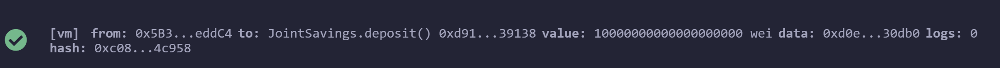
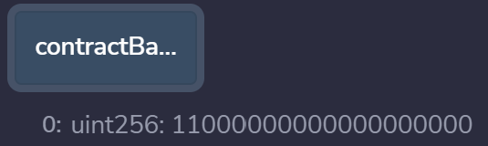
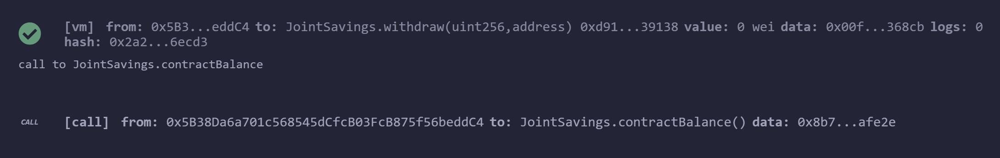
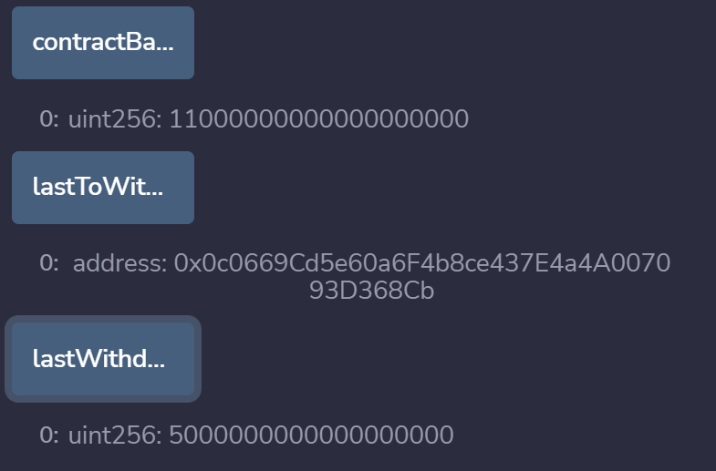
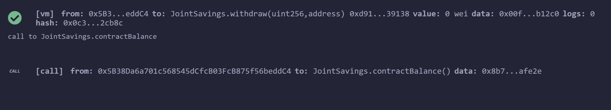
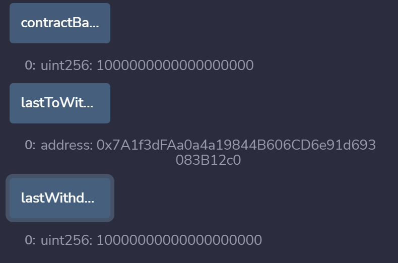

# Smart_Contract_Joint_Savings_Account
This is a joint savings account built using solidity smart contracts to allow users to deposit and withdrawal. Below is a preview of the functioning application running on Remix VM.

## Set Accounts:

---

## Deposit One Eth into Smart Contract:

---

## Deposit 10 Eth into Smart Contract:

---

## Updated Contract Balance Showing 11 Eth (converted to Wei):

---

## Withdraw 5 Eth to AccountOne:

---

## Withdraw 10 Eth to AccountTwo:

---

## Technologies

This analysis uses Python and the following libraries:
* [Solidity](https://docs.soliditylang.org/en/v0.8.17/) - Solidity is an object-oriented, high-level language for implementing smart contracts.

---

## Installation Guide and Usage

To run this app please follow these steps:

1. Clone the the Smart_Contract_Joint_Savings_Account repository to your local machine.

2. Open [Remix](https://remix.ethereum.org/)

3. Upload joint_savings.sol into your Remix file editer.

4. Compile the solidity code using version .5.0

5. Deploy the smart contract to the Remix VM (London).

6. Use the deposit and withdraw fuctions on the lefthand side of the editer.

7. Use the contractBalance, lastToWithdraw, and lastWithdraw functions to ensure the code ran correctly.

---

## Contributors

Derick Decesare | [LinkedIn](https://www.linkedin.com/in/derickdecesare/) | derick.decesare@gmail.com

---